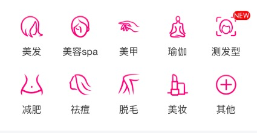

####滚动金刚位

标红色的为必须
 
| 参数KEY(类型)        | 说明         | 默认值  |
| ------------- |:-------------:| -----:|
| count(Number) |  单个屏幕容纳金刚位个数:8/10| 8 |
| categroy(Array)| 金岗位数据 [{icon: icon地址, hot: 金刚位右上角标签, title: 金岗位Title}, obj2, obj3,  .....]     |  []  |
| events(Object) | {click: 点击时间回调}      |   {} |
  		
 
注:多屏数 = Math.ceil(category.length / count)

  	使用：
  		let demoData = []; 
  		let item = {
    		img: 'http://b.hiphotos.baidu.com/nuomi/pic/item/1ad5ad6eddc451da18f70e7ebefd5266d0163225.jpg',
    		title: '游乐园'
		}
		for (let i = 0; i < 10; i++) {
    		demoData.push(item);
		}
  		
  		import { Categroy} from 'nuomi-ui';
  		
  		// 省略react相关代码
		class App extends Component {
  		...
  		
  			render() {
  				return <Categroy categroy={demoData} count={10} events={event} />
  			}
  		}
  		

  		
  效果：
  
  