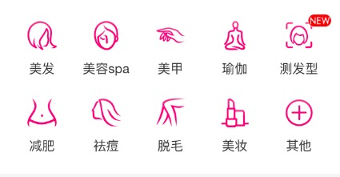

###糯米频道UI组件

####项目简介
   组件基于React的UI组件

   组件编译依赖于webpack

   webpack + less + es6

   模块ui+css按需加载

   构建测试demo:https://github.com/memoryza/nuomi-ui-test

####安装

 npm install git+https://github.com/memoryza/nuomi-component-ui.git#master --save

#### 模块列表
[带背景色的9号字像素块](https://github.com/memoryza/nuomi-component-ui/blob/master/doc/bg9.md)

[多针轮播](https://github.com/memoryza/nuomi-component-ui/blob/master/doc/carousel-banner.md)

[金刚位](https://github.com/memoryza/nuomi-component-ui/blob/master/doc/category.md)

####使用
	//demo

    import {Categroy} from 'nuomi-ui';

    let item = {
        img: 'http://b.hiphotos.baidu.com/nuomi/pic/item/1ad5ad6eddc451da18f70e7ebefd5266d0163225.jpg',
        title: '游乐园'
    }
    let itemList = [];
    for (let i = 0; i < 16; i++) {
        itemList.push(item);
    }
    class App extends Component {
        render() {
            return (

                <Categroy categroy={itemList} count={8}/>
            
)
        }
    };
    ReactDOM.render(<App />, document.getElementById('uiComponent'));

结果

